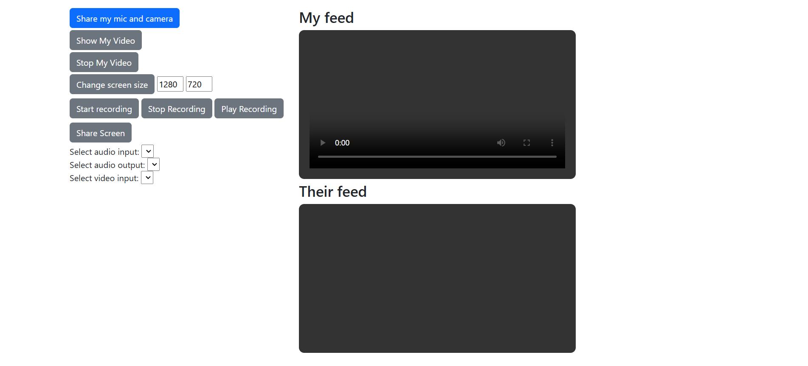
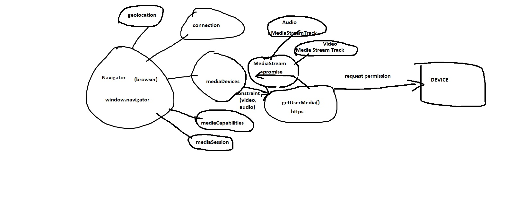
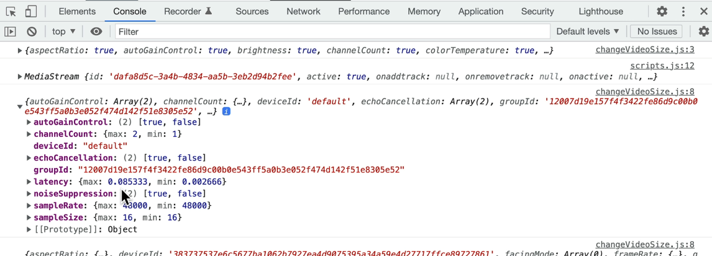
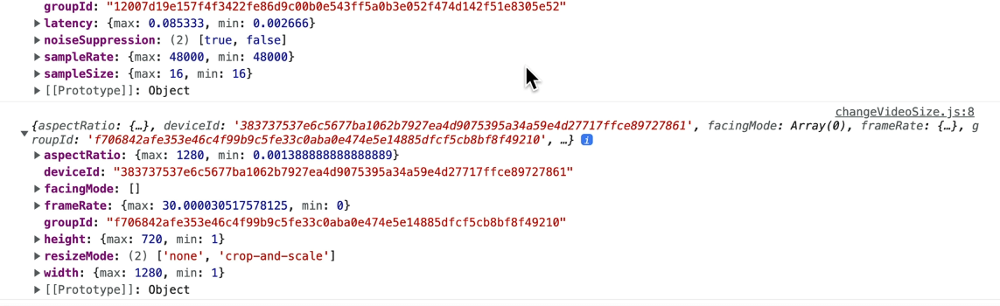
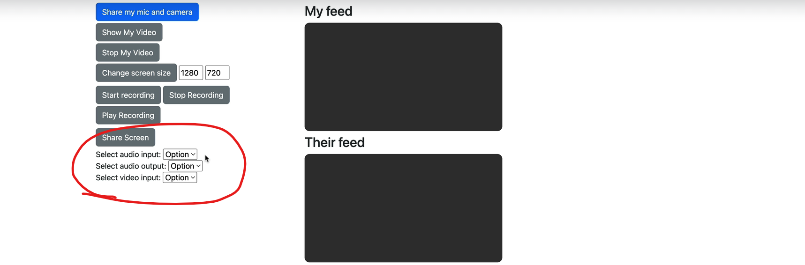

# WebRTC with Robert Bunch

## Section 01 - introduction to webRTC
### 1. what is WebRTC 

### summary - Mastering webRTC - make a video chat app!
- Course teaches you how to `connect audio/video streams` between computers 
- browser related
- set up a `signaling server` for` connection negotiation` 
- and `integrate webRTC into a React app with Redux`. 
- You'll learn to manage `multiple asynchronous sources` and organize your code effectively. 
- It's suitable for anyone familiar with JavaScript and Node
- using webRTC to implement video conferencing `without third-party services` (p2p)
- requisites include knowledge of GUM - `getUserMedia()` and `socket.io`
    - GUM (getting camera, mic, screen) - `getUserMedia()` -> requires user granting permission
- access to a Linux machine is required for later sections.

- webRTC uses UDP (fast) -> online gaming
- in contrast to TCP (reliable , acknowledgments, stable)

### 2. github source code
[https://github.com/robertbunch/webrtcCourse](https://github.com/robertbunch/webrtcCourse)

### 3. Getting the codebase for a specific video
- use github tags for reference when stuck, it puts you at the start of the lesson the tag references

### 4. How I code
- uses node 18 (16+ will do)
- his root directory is `videocode/`

### 5. But it's 2023: Why would I use webRTC over a 3rd party SDK (Zoom)?

- 3rd party is sdk and is reliable but may be restrictive
- when you need to build things yourself (more control) we use webRTC and its fast
- no licensing fee 
- control over sercurity and protection from 3rd party data breech
- cross platform 

---

## Section 02 - basics -> project teaching getUserMedia 
### 6. Project file setup - (3min)



- copy from given code:
  - gumplayground/index.html
  - gumplayground/scripts.js
  - gumplayground/styles.css

### 7. getUserMedia() - where everything starts - (13min)
- getUserMedia() requires you to use `https` (secure context)

```js
async function getMedia(constraints) {
  let stream = null;

  try {
    stream = await navigator.mediaDevices.getUserMedia(constraints);
    /* use the stream */
  } catch (err) {
    /* handle the error */
  }
}

```

- [MediaDevices](https://developer.mozilla.org/en-US/docs/Web/API/MediaDevices)
- provides access to connected media input devices like cameras and microphones, as well as screen sharing.
- prompts user for permission
- obtain access to any `hardware source` `of media data`

- `MediaDevices` belongs to `navigator.mediaDevices.getUserMedia()`
- `Navigator` - Navigator interface represents the `state` and the identity of the `user agent (browser)`. 
  - It allows scripts to query it and to register themselves to carry on some activities.
  - part of global scope (`window.navigator.` / `navigator.`)

  - Navigator.connection 
  - Navigator.geolocation
  - Navigator.mediaDevices
  - Navigator.mediaCapabilities
  - Navigator.mediaSession



### Contraints
- application can request the camera and microphone capabilities it needs and wants, using additional constraints
- `audio:true` -> has audio feedback so use earphones

```html
<!-- index.html -->
<button id="share" class="btn btn-primary d-block mb-1">Share my mic and camera</button>
```

```js
//src/gumplayground/script.js

let stream = null;

const constraints = {
  audio: true, //audio feedback (reverb) use HEADPHONES
  video: true
}

const getMicAndCamera = async (e) => {
  try{
    stream = await navigator.mediaDevices.getUserMedia(constraints);
  }
  catch{
    console.log('user denied access to contraints')
  }
}

//attach event handler
document.querySelector('#share').addEventListener('click', getMicAndCamera)
```

### TROUBLESHOOT
- while testing, in windows: your camera and microphone must be on:
- settings -> camera privacy settings -> camera access -> ON
- settings -> microphone privacy settings -> microphone access -> ON
- Expect:
```bash
# console log
MediaStream {id: '33c6bd0a-95e1-4951-88c4-62ce312d8cef', active: true, onaddtrack: null, onremovetrack: null, onactive: null, …}
```

### Other constraints
#### video contraints
- an application can request the camera and microphone capabilities it needs and wants:
  - `constraints = { audio: true, video: { width: 1280, height: 720 } }`

#### ideal
- `ideal` value, when used, has gravity — which means that the browser will try to find the setting (and camera, if you have more than one), with the smallest fitness distance
  - `constraints = { audio: true, video: { width: { ideal: 1280 }, height: { ideal: 720 }}`

#### front camera
- on mobile devices, the following will prefer the `front camera` (if one is available) over the rear one:
  - `constraints = { audio: true, video: { facingMode: "user" }}`

#### rear camera
- `constraints = { audio: true, video: { facingMode: { exact: "environment" }}}`

#### requesting camera by id or if not available, a different camera 
- `deviceId` constraint. If you have a deviceId from `mediaDevices.enumerateDevices()`, you can use it to request a specific device
- return the camera you requested, or a different camera if that specific camera is no longer available
- `constraints = {video: { deviceId: myPreferredCameraDeviceId }}`

#### requesting an exact camera by deviceid
- `constraints = { video: {deviceId: {exact: myExactCameraOrBustDeviceId } }}`

### 8. play the feed, getTracks(), and MediaStreamTracks - (7min)
- TODO: putting the stream in videoEl: `<video id="videoEl">`
- `showMyFeed()` -> set our MediaStream (stream) to our video tag `videoEl.srcObject = stream;`

#### where is the video and audio source?
- `getTracks()` -> gets everything (gets each individual track part of media stream that came from getUserMedia)

```bash output
(2) [MediaStreamTrack, MediaStreamTrack]
0: MediaStreamTrack {kind: 'audio', id: '7e9619ee-95e0-4f3a-93d2-0736da61dc4f', label: 'Default - Microphone Array (Realtek(R) Audio)', enabled: true, muted: false, …}
1: MediaStreamTrack {kind: 'video', id: '8fc0682b-b8e4-4a01-9f51-d863ad5acc60', label: 'Integrated Camera (13d3:56a6)', enabled: true, muted: false, …}
length: 2
```

- `getAudioTracks()` -> gets audio
- `getVideoTracks()` -> gets video

#### stopping the video feed
- MediaStreamTrack `.stop()` -> disassociates track with the source


```js
//script.js
const videoEl = document.querySelector('#my-video');
let stream = null;

const constraints = {
  audio: true, //audio feedback (reverb) use HEADPHONES
  video: true
}

const getMicAndCamera = async (e) => {
  try{
    stream = await navigator.mediaDevices.getUserMedia(constraints);
    console.log(stream);
  }
  catch(error){
    console.log('user denied access to contraints:', error);
  }
};

const showMyFeed = async (e) => {
  videoEl.srcObject = stream; //this will set our MediaStream (stream) to our video tag
  const tracks = stream.getTracks();
  console.log(tracks);
}

const stopMyFeed = e => {
  const tracks = stream.getTracks();  
  tracks.forEach(track => {
    // console.log(track);
    track.stop(); //disassociates track with the source
  })
}

document.querySelector('#share').addEventListener('click', e => getMicAndCamera(e));
document.querySelector('#show-video').addEventListener('click', e=> showMyFeed(e));
document.querySelector('#stop-video').addEventListener('click', e=> stopMyFeed(e));
```

### 9. A few UI updates - (9min)
- NOTE: this is JavaScript DOM manipulation (imperative). 
  - react is declarative and is easier ways to do this


### JS - Imperative approach
- adding `changeButtons.js` to `index.html`
- deals css styling (resets css styling and sets what is necessary)
  - green = btn-success
  - blue = btn-primary
  - grey = btn-secondary
  - red = btn-danger

- NOTE: my eyes are bleeding watching this...why?
  - the implementation of changeButtons: you are passing an array of meaningless strings (colors) to associate with `buttonsById` 
  - you have to physically adjust each element in array

### 10. Constraints overview - getSupportedConstraints() and getCapabilities() - (10min)
- the constraints object passed to getUserMedia()
  - changing the screensize (video feed resolution)
- getUserMedia() constraints require `either or both` audio/media

```js
getUserMedia({
  video: {
    width: 1280, height: 720
  }
})
```
### MediaTrackConstraints
- dictionary used to describe a set of capabilities and the value of values each can take on.
- a constraints dictionary is passed into `applyConstraints()`
- MediaStreamTrack provides `getConstraints()` method returns `MediaTrackConstraints` object
- ie you can ask a track for the constraints available

- browser will try honor these resolutions
- `min`, `max` - as close as possible
- `exact` - if you specify `exact` but no camera exists with this resolution or higher, an `OvercontrainedError` returned.
- `ideal` - browser will try

### getSupportedContraints()
- tells us browser capabilities - returns a boolean list of whether something is supported.
- `const supportedConstraints = navigator.mediaDevices.getSupportedConstraints()`
- create `src/gumplayground/changeVideoSize.js`
```js
// changeVideoSize.js
const supportedConstraints = navigator.mediaDevices.getSupportedConstraints();
console.log("supportedConstraints: ", supportedConstraints);

const changeVideoSize = () => {
  stream.getTracks().forEach(track=>{
    const capabilities = track.getCapabilities()
    console.log(capabilities);
  })  
}
```

### getCapabilities()
- you can use MediaStreamTrack .getCapabilities()
- returns a `MediaTrackCapabilities` object specifying the values or range of values of each constrainable property
- the difference between `supportedConstraints` and `getCapabilities()` is the latter gives actual values of supported properties

- getCapabilities() specific for audio track



- getCapabilities() specific for video track



### 11. Changing resolution, framerate, aspect ratio - applyConstraints() - (8min)
- get getCapabilities() 
  - height: {max:720}
  - width: {max:1280}
- once you know the capabilities of the browser, you can call `applyContraints()` against a track
- the constraints properties are specific to the particular type of track (audio/video)
- with applyConstraints() we are not applying it to getUserMedia, it is being applied to a track

- example of using constraints specific for video 
```js
const constraints = {
  width: {min:640, ideal: 1280},
  height: {min:480, ideal: 720},
  advanaced: [{width:1920, height:1280}, {aspectRatio: 1.333}]
}
```

- setting width/height to input value as long as its less than `MediaCapabilities.width.max` and `MediaCapabilities.height.max`
```js
const capabilities = track.getCapabilities();
console.log('capabilities: ', capabilities);

const height = document.querySelector('#vid-height').value;
const width = document.querySelector('#vid-width').value;

const vConstraints = {
  height: {exact: height < capabilities.height.max ? height: capabilities.height.max}, 
  width: {exact: width < capabilities.width.max ? width: capabilities.width.max}, 
  // frameRate: 5,
  // aspectRatio: 10 
}
```

### testing
- ensure `windows` -> `settings` for `microphone privacy` and `camera privacy` is set to `on`

### 12. Recording a feed - MediaRecorder and webRTC - (13min)
- NOTE: web apis -> `MediaStream Recording api` (aka `Media Recording API`, `MediaRecorder API`) for start recording, stop recording
  - `MediaRecorder`
- NOTE: web apis -> `WebRTC api` is at same level `MediaStream Recording api` in `mdn docs`
- NOTE: `MediaStream` is not part of `WebRTC api` because `MediaDevices.getUserMedia()` creates it
- so MediaStream recording API is meant to work with `MediaStream` or `HTMLMediaElement`

- we create `src/gumplayground/screenRecorder.js`
- we add this to index.js
```js
// screenRecorder.js
const startRecording = () => {}
const stopRecording = () => {}
const playRecording = () => {}
```
- we add the listener to scripts.js
```js
//...
document.querySelector('#start-record').addEventListener('click', e=>startRecording(e));
document.querySelector('#stop-record').addEventListener('click', e=>stopRecording(e));
document.querySelector('#play-record').addEventListener('click', e=>playRecording(e));
```

### MediaRecorder
- [mdn docs](https://developer.mozilla.org/en-US/docs/Web/API/MediaRecorder/MediaRecorder)
- `const mediaRecorder = new MediaRecorder(stream)`
- you have to pass a stream 
- can also pass options
  - mimeType -> format for resulting media / codec
- instance methods
- events

```js
// src/gumplayground/screenRecorder.js
let mediaRecorder;
let recordedBlobs;

const startRecording = () => {
  if (!stream) {
    //you could use mediaStream!
    alert("No current feed");
    return;
  }
  console.log("Start recording");
  recordedBlobs = []; // an array to hold the blobs for playback
  //you could use mediaStream to record!
  mediaRecorder = new MediaRecorder(stream); //make a mediaRecorder from the constructor
  mediaRecorder.ondataavailable = (e) => {
    //ondataavailable will run when the stream ends, or stopped, or we specifically ask for it
    console.log("Data is available for the media recorder!");
    recordedBlobs.push(e.data);
  };
  mediaRecorder.start();
  changeButtons([
    "green",
    "green",
    "blue",
    "blue",
    "green",
    "blue",
    "grey",
    "blue",
  ]);
};

const stopRecording = () => {
  if (!mediaRecorder) {
    alert("Please record before stopping!");
    return;
  }
  console.log("stop recording");
  mediaRecorder.stop();
  changeButtons([
    "green",
    "green",
    "blue",
    "blue",
    "green",
    "green",
    "blue",
    "blue",
  ]);
};

const playRecording = () => {
  console.log("play recording");
  if (!recordedBlobs) {
    alert("No Recording saved");
    return;
  }
  const superBuffer = new Blob(recordedBlobs); // superBuffer is a super buffer of our array of blobs
  const recordedVideoEl = document.querySelector("#other-video");
  recordedVideoEl.src = window.URL.createObjectURL(superBuffer);
  recordedVideoEl.controls = true;
  recordedVideoEl.play();
  changeButtons([
    "green",
    "green",
    "blue",
    "blue",
    "green",
    "green",
    "green",
    "blue",
  ]);
};

```

### 13. Update buttons - (5min)
- see code at lesson 12
- move changeButtons from showMyFeed() and add to screenRecorder -> startRecording()
- TODO: add `src/gumplayground/shareScreen.js`
- script.js -> add listener for `share-screen` button `document.querySelector('#share-screen').addEventListener('click', e=>shareScreen(e));`

```js
// shareScreen.js
const shareScreen = async () => {
  const options = {
    video: true,
    audio: false,
    surfaceSwitching: "include", //include/exclude NOT true/false
  };
  try {
    mediaStream = await navigator.mediaDevices.getDisplayMedia(options);
  } catch (err) {
    console.log(err);
  }

  //we don't handle all button paths. To do so, you'd need
  //to check the DOM or use a UI framework.
  changeButtons([
    "green",
    "green",
    "blue",
    "blue",
    "green",
    "green",
    "green",
    "green",
  ]);
};

```
### 14. Capturing the screen - (10min)


#### getDisplayMedia()
- capability to `share the entire screen` not just browser window
- `navigator.mediaDevices.getDisplayMedia()` (we've been working with `navigator.mediaDevices.getUserMedia`)
- returns a promise that resolves to MediaStream
- `.getDisplayMedia()` - prompts the user to select and grant permission to capture the contents of a display or portion thereof (eg. window) as a `MediaStream` (which consists of `MediaStreamTrack`)
- the resultant stream can then be recorded using the `MediaStream Recording API` or transmitted as part of `WebRTC session`
- you can pass options to `getDisplayMedia(options)`
  - `video` - default is true
  - `audio` - default is false
  - `selfBrowserSurface` - whether the browser should allow the user to select the current tab for capture. 
    - helps avoid infinite hall of mirrors effect
    - possible values: `include` or `exclude`
- you can record the mediaStream - `mediaStream` declared in `script.js` and set in `shareScreen.js`

```js
//shareScreen.js
//...
mediaStream = await navigator.mediaDevices.getDisplayMedia(options);
```

### 15. Getting available input/outputs with enumerateDevices() - (9min)

- valid options for media devices (input/output)



- index.html
  - `<script src='inputOutput.js'></script>`


- add event listeners
```js
//src/gumplayground/script.js
document.querySelector("#audio-input").addEventListener("change", (e) => changeAudioInput(e));
document.querySelector("#audio-output").addEventListener("change", (e) => changeAudioOutput(e));
document.querySelector("#video-input").addEventListener("change", (e) => changeVideo(e));
```

### enumerateDevices
- navigator.mediaDevices -> `enumerateDevices()`
  - method requests a list of available input/output devices (microphone, camera, headset) 
- must be called in a secure context
  - non-local resource -> https:// or wss://
  - local-resources -> `http://localhost` , `http://*.localhost` and `file://`
  - vscode `live-server` should work fine too (localhost)

#### return value
- returned `promise` receives an array of MediaDevicesInfo 
- resolves with a [MediaDevicesInfo](https://developer.mozilla.org/en-US/docs/Web/API/MediaDeviceInfo) array
- each item in array describes one of the available input/output devices
- order is significant (default capture devices listed first)
- access to particular devices is gated by `Permissions api`


```js
//src/gumplayground/inputOutput.js

const audioInputEl = document.querySelector("#audio-input");
const audioOutputEl = document.querySelector("#audio-output");
const videoInputEl = document.querySelector("#video-input");

const getDevices = async () => {
  try {
    const devices = await navigator.mediaDevices.enumerateDevices();
    console.log(devices);
    devices.forEach((d) => {
      const option = document.createElement("option"); //create the option tag
      option.value = d.deviceId;
      option.text = d.label;
      //add the option tag we just created to the right select
      if (d.kind === "audioinput") {
        audioInputEl.appendChild(option);
      } else if (d.kind === "audiooutput") {
        audioOutputEl.appendChild(option);
      } else if (d.kind === "videoinput") {
        videoInputEl.appendChild(option);
      }
    });
  } catch (err) {
    console.log(err);
  }
};

const changeAudioInput = async (e) => {
  //changed audio input!!!
  const deviceId = e.target.value;
  const newConstraints = {
    audio: { deviceId: { exact: deviceId } },
    video: true,
  };
  try {
    stream = await navigator.mediaDevices.getUserMedia(newConstraints);
    console.log(stream);
    const tracks = stream.getAudioTracks();
    console.log(tracks);
  } catch (err) {
    console.log(err);
  }
};

const changeAudioOutput = async (e) => {
  await videoEl.setSinkId(e.target.value);
  console.log("Changed audio device!");
};

const changeVideo = async (e) => {
  //changed video input!!!
  const deviceId = e.target.value;
  const newConstraints = {
    audio: true,
    video: { deviceId: { exact: deviceId } },
  };
  try {
    stream = await navigator.mediaDevices.getUserMedia(newConstraints);
    console.log(stream);
    const tracks = stream.getVideoTracks();
    console.log(tracks);
  } catch (err) {
    console.log(err);
  }
};

getDevices();

```


#### FIX - creating a secure context
- src/gumplayground -> `Set-ExecutionPolicy -ExecutionPolicy RemoteSigned -Scope CurrentUser`
- npm i -g pnpm 
- pnpm init
- pnpm i express
- pnpm add -g nodemon

- create `expressServer.js`

```js
//gumplayground/expressServer.js

//we need this to run in a localhost context instead of file
//so that we can run enumerate devices (it must be run in a secure context)
//and localhost counts
const path = require('path');
const express = require('express');
const app = express();
app.use(express.static(path.join(__dirname)));
app.listen(3000)
```

### testing
- run with `pnpm run dev` (added script to package.json)
- click `share my mic and camera`
- note the updated console.log

### 16. Loading up input/output options - (11min)

---

## Section 03 - rtcPeerConnection - Stream video, peer-to-peer
### 17. Section Demo & Overview - (6min)
### 18. rtcPeerConnection and signaling - (7min)
### 19. Signaling Part 1 - SDP - (3min)
### 20. Signaling Part 2 - ICE (and STUN) - (7min)
### 21. File Structure - (7min)
### 22. local RTC - (14min)
### 23. setLocalDescription() - (4min)
### 24. Socket.io and HTTPS setup - (9min)
### 25. Connection TaskList - (6min)
### 26. Connection TaskList - part 2 - (12min)
### 27. emit newOffer - (9min)
### 28. Emit iceCandidates - (8min)
### 29. Load existing and new offers on all clients - (9min)
### 30. Create answer - (9min)
### 31. Error handling the signaling process - (8min)
### 32. Emitting answer - (7min)
### 33. Listening for answer and setRemoteDescription(answer) - (6min)
### 34. Apply ICE candidates - Part 1 - (8min)
### 35. Apply ICE candidates - Part 2 - (5min)
### 36. Add tracks from remote peer - MAGIC!! - (6min)
### 37. Loading on another device on the same network - (5min)

---

## Section 04 - WebRTC Process review - review it

### 38. The Process (on the board) - (24min)
### 39. Code Review - (50min)

---

## Section 05 - webRTC and React - TeleLegal site
### 40. Project Demo - (6min)
### 41. Project Structure and Front-end Setup - (6min)
### 42. Chrome and localhost certs - (1min)
### 43. Back-end Setup - (8min)
### 44. Creating a JWT & link to simulate scheduling - (11min)
### 45. Add React-Router for our front-end - (5min)
### 46. Setup Join-Video route and get the decoded data in React - (8min)
### 47. Add starting components - (10min)
### 48. Wire up redux and make callStatus reducer - (8min)
### 49. Add action buttons, bootstrap, and fontawesome - (7min)
### 50. getUserMedia() and store the stream in redux - (9min)
### 51. Create peerConnection and store it in redux - (7min)
### 52. Thinking through where our functions belong (& a few bug fixes) - (6min)
### 53. Abstracting the Video and Audio buttons - (8min)
### 54. Adding the local video feed - (10min)
### 55. Add our tracks to the peerConnection - (8min)
### 56. Enable and disable (mute) the local video feed - (6min)
### 57. Display local video inputs (camera options) - (11min)
### 58. Set new video device on select - (7min)
### 59. replaceTracks() - (8min)
### 60. Abstract DropDown component - (3min)
### 61. Set up AudioButton component - (11min)
### 62. Switch Audio Input and Output Devices - (11min)
### 63. Start, mute, unmute audio - (10min)
### 64. Organize offers on backEnd and add uuid - (8min)
### 65. createOffer() once the tracks are shared - (13min)
### 66. Add Dashboard markup for professional - (5min)
### 67. Optional - Overview of markup - (2min)
### 68. Authenticate professional - (10min)
### 69. socket refactoring - (9min)
### 70. Reorganize Appointment Data - (3min)
### 71. Pull Appointment Data - (9min)
### 72. Listen for offers on the client - (11min)
### 73. Create join video route for professional - (6min)
### 74. Add Call Info to Professional Video Page - (4min)
### 75. Create Answer and set Descriptions - (10min)
### 76. Review Task List and Cheer for Our Progress - (7min)
### 77. Emit Answer Up To Server - (8min)
### 78. Listen for New Answer On the Client - (12min)
### 79. Emit Ice Candidates To Server - (9min)
### 80. Send Ice Candidates to clients - (13min)
### 81. Add Ice Candidates to Peer Connection - (12min)
### 82. AddTracks and... VICTORY!!! (test app) - (6min)
### 83. Fix 2 small bugs - (2min)
### 84. Make the HangupButton do something! - (5min)
### 85. ReplaceTracks on change device - (8min)

---

## Section 06 - Deploying our Apps to AWS
### 86. Drawing Out And Explaining The Process - (15min)
### 87. Warning... this section is deploying, not WebRTC and might be hard - (1min)
### 88. Setting up a (hopefully) free AWS server to run our app on - (36min)
### 89. Getting a Domain &Setting It To Point At Our Server & Install Apache - (17min)
### 90. Pulling files onto our server from github and building React - (20min)
### 91. htaccess file and vhost for next lecture - (1min)
### 92. Vhost - Telling Apache Where Our Sites Are - (12min)
### 93. Reverse Proxy Vhost - For the backend - (1min)
### 94. HTTPS and Reverse Proxy Vhost - (23min)

---

## Section 07 - Scaling WebRTC - beyond the mesh
### 95. Your options - an SFU, MCU, and mesh - (13min)