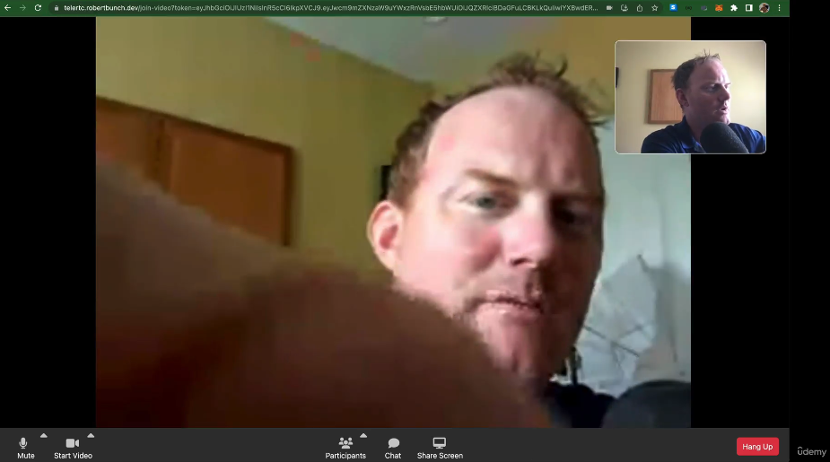

# WebRTC with Robert Bunch

## Section 01 - introduction to webRTC
### 1. what is WebRTC 

### summary - Mastering webRTC - make a video chat app!
- Course teaches you how to `connect audio/video streams` between computers 
- browser related
- set up a `signaling server` for` connection negotiation` 
- and `integrate webRTC into a React app with Redux`. 
- You'll learn to manage `multiple asynchronous sources` and organize your code effectively. 
- It's suitable for anyone familiar with JavaScript and Node
- using webRTC to implement video conferencing `without third-party services` (p2p)
- requisites include knowledge of GUM - `getUserMedia()` and `socket.io`
    - GUM (getting camera, mic, screen) - `getUserMedia()` -> requires user granting permission
- access to a Linux machine is required for later sections.

- webRTC uses UDP (fast) -> online gaming
- in contrast to TCP (reliable , acknowledgments, stable)

### 2. github source code
[https://github.com/robertbunch/webrtcCourse](https://github.com/robertbunch/webrtcCourse)

### 3. Getting the codebase for a specific video
- use github tags for reference when stuck, it puts you at the start of the lesson the tag references

### 4. How I code
- uses node 18 (16+ will do)
- his root directory is `videocode/`

### 5. But it's 2023: Why would I use webRTC over a 3rd party SDK (Zoom)?

- 3rd party is sdk and is reliable but may be restrictive
- when you need to build things yourself (more control) we use webRTC and its fast
- no licensing fee 
- control over sercurity and protection from 3rd party data breech
- cross platform 

---

## Section 02 - basics -> project teaching getUserMedia 
### 6. Project file setup - (3min)

- section outcome 


- copy from given code:
  - gumplayground/index.html
  - gumplayground/scripts.js
  - gumplayground/styles.css

### 7. getUserMedia() - where everything starts - (13min)
- getUserMedia() requires you to use `https` (secure context)

```js
async function getMedia(constraints) {
  let stream = null;

  try {
    stream = await navigator.mediaDevices.getUserMedia(constraints);
    /* use the stream */
  } catch (err) {
    /* handle the error */
  }
}

```

- [MediaDevices](https://developer.mozilla.org/en-US/docs/Web/API/MediaDevices)
- provides access to connected media input devices like cameras and microphones, as well as screen sharing.
- prompts user for permission
- obtain access to any `hardware source` `of media data`

- `MediaDevices` belongs to `navigator.mediaDevices.getUserMedia()`
- `Navigator` - Navigator interface represents the `state` and the identity of the `user agent (browser)`. 
  - It allows scripts to query it and to register themselves to carry on some activities.
  - part of global scope (`window.navigator.` / `navigator.`)

  - Navigator.connection 
  - Navigator.geolocation
  - Navigator.mediaDevices
  - Navigator.mediaCapabilities
  - Navigator.mediaSession


### Contraints
- application can request the camera and microphone capabilities it needs and wants, using additional constraints
- `audio:true` -> has audio feedback so use earphones

```html
<!-- index.html -->
<button id="share" class="btn btn-primary d-block mb-1">Share my mic and camera</button>
```

```js
//src/gumplayground/script.js

let stream = null;

const constraints = {
  audio: true, //audio feedback (reverb) use HEADPHONES
  video: true
}

const getMicAndCamera = async (e) => {
  try{
    stream = await navigator.mediaDevices.getUserMedia(constraints);
  }
  catch{
    console.log('user denied access to contraints')
  }
}

//attach event handler
document.querySelector('#share').addEventListener('click', getMicAndCamera)
```

### TROUBLESHOOT
- while testing, in windows: your camera and microphone must be on:
- settings -> camera privacy settings -> camera access -> ON
- settings -> microphone privacy settings -> microphone access -> ON
- Expect:
```bash
# console log
MediaStream {id: '33c6bd0a-95e1-4951-88c4-62ce312d8cef', active: true, onaddtrack: null, onremovetrack: null, onactive: null, …}
```

### Other constraints
#### video contraints
- an application can request the camera and microphone capabilities it needs and wants:
  - `constraints = { audio: true, video: { width: 1280, height: 720 } }`

#### ideal
- `ideal` value, when used, has gravity — which means that the browser will try to find the setting (and camera, if you have more than one), with the smallest fitness distance
  - `constraints = { audio: true, video: { width: { ideal: 1280 }, height: { ideal: 720 }}`

#### front camera
- on mobile devices, the following will prefer the `front camera` (if one is available) over the rear one:
  - `constraints = { audio: true, video: { facingMode: "user" }}`

#### rear camera
- `constraints = { audio: true, video: { facingMode: { exact: "environment" }}}`

#### requesting camera by id or if not available, a different camera 
- `deviceId` constraint. If you have a deviceId from `mediaDevices.enumerateDevices()`, you can use it to request a specific device
- return the camera you requested, or a different camera if that specific camera is no longer available
- `constraints = {video: { deviceId: myPreferredCameraDeviceId }}`

#### requesting an exact camera by deviceid
- `constraints = { video: {deviceId: {exact: myExactCameraOrBustDeviceId } }}`

### 8. play the feed, getTracks(), and MediaStreamTracks - (7min)
- TODO: putting the stream in videoEl: `<video id="videoEl">`
- `showMyFeed()` -> set our MediaStream (stream) to our video tag `videoEl.srcObject = stream;`

#### where is the video and audio source?
- `getTracks()` -> gets everything (gets each individual track part of media stream that came from getUserMedia)

```bash output
(2) [MediaStreamTrack, MediaStreamTrack]
0: MediaStreamTrack {kind: 'audio', id: '7e9619ee-95e0-4f3a-93d2-0736da61dc4f', label: 'Default - Microphone Array (Realtek(R) Audio)', enabled: true, muted: false, …}
1: MediaStreamTrack {kind: 'video', id: '8fc0682b-b8e4-4a01-9f51-d863ad5acc60', label: 'Integrated Camera (13d3:56a6)', enabled: true, muted: false, …}
length: 2
```

- `getAudioTracks()` -> gets audio
- `getVideoTracks()` -> gets video

#### stopping the video feed
- MediaStreamTrack `.stop()` -> disassociates track with the source


```js
//script.js
const videoEl = document.querySelector('#my-video');
let stream = null;

const constraints = {
  audio: true, //audio feedback (reverb) use HEADPHONES
  video: true
}

const getMicAndCamera = async (e) => {
  try{
    stream = await navigator.mediaDevices.getUserMedia(constraints);
    console.log(stream);
  }
  catch(error){
    console.log('user denied access to contraints:', error);
  }
};

const showMyFeed = async (e) => {
  videoEl.srcObject = stream; //this will set our MediaStream (stream) to our video tag
  const tracks = stream.getTracks();
  console.log(tracks);
}

const stopMyFeed = e => {
  const tracks = stream.getTracks();  
  tracks.forEach(track => {
    // console.log(track);
    track.stop(); //disassociates track with the source
  })
}

document.querySelector('#share').addEventListener('click', e => getMicAndCamera(e));
document.querySelector('#show-video').addEventListener('click', e=> showMyFeed(e));
document.querySelector('#stop-video').addEventListener('click', e=> stopMyFeed(e));
```

### 9. A few UI updates - (9min)
- NOTE: this is JavaScript DOM manipulation (imperative). 
  - react is declarative and is easier ways to do this


### JS - Imperative approach
- adding `changeButtons.js` to `index.html`
- deals css styling (resets css styling and sets what is necessary)
  - green = btn-success
  - blue = btn-primary
  - grey = btn-secondary
  - red = btn-danger

- NOTE: my eyes are bleeding watching this...why?
  - the implementation of changeButtons: you are passing an array of meaningless strings (colors) to associate with `buttonsById` 
  - you have to physically adjust each element in array

### 10. Constraints overview - getSupportedConstraints() and getCapabilities() - (10min)
- the constraints object passed to getUserMedia()
  - changing the screensize (video feed resolution)
- getUserMedia() constraints require `either or both` audio/media

```js
getUserMedia({
  video: {
    width: 1280, height: 720
  }
})
```
### MediaTrackConstraints
- dictionary used to describe a set of capabilities and the value of values each can take on.
- a constraints dictionary is passed into `applyConstraints()`
- MediaStreamTrack provides `getConstraints()` method returns `MediaTrackConstraints` object
- ie you can ask a track for the constraints available

- browser will try honor these resolutions
- `min`, `max` - as close as possible
- `exact` - if you specify `exact` but no camera exists with this resolution or higher, an `OvercontrainedError` returned.
- `ideal` - browser will try

### getSupportedContraints()
- tells us browser capabilities - returns a boolean list of whether something is supported.
- `const supportedConstraints = navigator.mediaDevices.getSupportedConstraints()`
- create `src/gumplayground/changeVideoSize.js`
```js
// changeVideoSize.js
const supportedConstraints = navigator.mediaDevices.getSupportedConstraints();
console.log("supportedConstraints: ", supportedConstraints);

const changeVideoSize = () => {
  stream.getTracks().forEach(track=>{
    const capabilities = track.getCapabilities()
    console.log(capabilities);
  })  
}
```

### getCapabilities()
- you can use MediaStreamTrack .getCapabilities()
- returns a `MediaTrackCapabilities` object specifying the values or range of values of each constrainable property
- the difference between `supportedConstraints` and `getCapabilities()` is the latter gives actual values of supported properties

- getCapabilities() specific for audio track


- getCapabilities() specific for video track


### 11. Changing resolution, framerate, aspect ratio - applyConstraints() - (8min)
- get getCapabilities() 
  - height: {max:720}
  - width: {max:1280}
- once you know the capabilities of the browser, you can call `applyContraints()` against a track
- the constraints properties are specific to the particular type of track (audio/video)
- with applyConstraints() we are not applying it to getUserMedia, it is being applied to a track

- example of using constraints specific for video 
```js
const constraints = {
  width: {min:640, ideal: 1280},
  height: {min:480, ideal: 720},
  advanaced: [{width:1920, height:1280}, {aspectRatio: 1.333}]
}
```

- setting width/height to input value as long as its less than `MediaCapabilities.width.max` and `MediaCapabilities.height.max`
```js
const capabilities = track.getCapabilities();
console.log('capabilities: ', capabilities);

const height = document.querySelector('#vid-height').value;
const width = document.querySelector('#vid-width').value;

const vConstraints = {
  height: {exact: height < capabilities.height.max ? height: capabilities.height.max}, 
  width: {exact: width < capabilities.width.max ? width: capabilities.width.max}, 
  // frameRate: 5,
  // aspectRatio: 10 
}
```

### testing
- ensure `windows` -> `settings` for `microphone privacy` and `camera privacy` is set to `on`

### 12. Recording a feed - MediaRecorder and webRTC - (13min)
- NOTE: web apis -> `MediaStream Recording api` (aka `Media Recording API`, `MediaRecorder API`) for start recording, stop recording
  - `MediaRecorder`
- NOTE: web apis -> `WebRTC api` is at same level `MediaStream Recording api` in `mdn docs`
- NOTE: `MediaStream` is not part of `WebRTC api` because `MediaDevices.getUserMedia()` creates it
- so MediaStream recording API is meant to work with `MediaStream` or `HTMLMediaElement`

- we create `src/gumplayground/screenRecorder.js`
- we add this to index.js
```js
// screenRecorder.js
const startRecording = () => {}
const stopRecording = () => {}
const playRecording = () => {}
```
- we add the listener to scripts.js
```js
//...
document.querySelector('#start-record').addEventListener('click', e=>startRecording(e));
document.querySelector('#stop-record').addEventListener('click', e=>stopRecording(e));
document.querySelector('#play-record').addEventListener('click', e=>playRecording(e));
```

### MediaRecorder
- [mdn docs](https://developer.mozilla.org/en-US/docs/Web/API/MediaRecorder/MediaRecorder)
- `const mediaRecorder = new MediaRecorder(stream)`
- you have to pass a stream 
- can also pass options
  - mimeType -> format for resulting media / codec
- instance methods
- events

```js
// src/gumplayground/screenRecorder.js
let mediaRecorder;
let recordedBlobs;

const startRecording = () => {
  if (!stream) {
    //you could use mediaStream!
    alert("No current feed");
    return;
  }
  console.log("Start recording");
  recordedBlobs = []; // an array to hold the blobs for playback
  //you could use mediaStream to record!
  mediaRecorder = new MediaRecorder(stream); //make a mediaRecorder from the constructor
  mediaRecorder.ondataavailable = (e) => {
    //ondataavailable will run when the stream ends, or stopped, or we specifically ask for it
    console.log("Data is available for the media recorder!");
    recordedBlobs.push(e.data);
  };
  mediaRecorder.start();
  changeButtons([
    "green",
    "green",
    "blue",
    "blue",
    "green",
    "blue",
    "grey",
    "blue",
  ]);
};

const stopRecording = () => {
  if (!mediaRecorder) {
    alert("Please record before stopping!");
    return;
  }
  console.log("stop recording");
  mediaRecorder.stop();
  changeButtons([
    "green",
    "green",
    "blue",
    "blue",
    "green",
    "green",
    "blue",
    "blue",
  ]);
};

const playRecording = () => {
  console.log("play recording");
  if (!recordedBlobs) {
    alert("No Recording saved");
    return;
  }
  const superBuffer = new Blob(recordedBlobs); // superBuffer is a super buffer of our array of blobs
  const recordedVideoEl = document.querySelector("#other-video");
  recordedVideoEl.src = window.URL.createObjectURL(superBuffer);
  recordedVideoEl.controls = true;
  recordedVideoEl.play();
  changeButtons([
    "green",
    "green",
    "blue",
    "blue",
    "green",
    "green",
    "green",
    "blue",
  ]);
};

```

### 13. Update buttons - (5min)
- see code at lesson 12
- move changeButtons from showMyFeed() and add to screenRecorder -> startRecording()
- TODO: add `src/gumplayground/shareScreen.js`
- script.js -> add listener for `share-screen` button `document.querySelector('#share-screen').addEventListener('click', e=>shareScreen(e));`

```js
// shareScreen.js
const shareScreen = async () => {
  const options = {
    video: true,
    audio: false,
    surfaceSwitching: "include", //include/exclude NOT true/false
  };
  try {
    mediaStream = await navigator.mediaDevices.getDisplayMedia(options);
  } catch (err) {
    console.log(err);
  }

  //we don't handle all button paths. To do so, you'd need
  //to check the DOM or use a UI framework.
  changeButtons([
    "green",
    "green",
    "blue",
    "blue",
    "green",
    "green",
    "green",
    "green",
  ]);
};

```
### 14. Capturing the screen - (10min)


#### getDisplayMedia()
- capability to `share the entire screen` not just browser window
- `navigator.mediaDevices.getDisplayMedia()` (we've been working with `navigator.mediaDevices.getUserMedia`)
- returns a promise that resolves to MediaStream
- `.getDisplayMedia()` - prompts the user to select and grant permission to capture the contents of a display or portion thereof (eg. window) as a `MediaStream` (which consists of `MediaStreamTrack`)
- the resultant stream can then be recorded using the `MediaStream Recording API` or transmitted as part of `WebRTC session`
- you can pass options to `getDisplayMedia(options)`
  - `video` - default is true
  - `audio` - default is false
  - `selfBrowserSurface` - whether the browser should allow the user to select the current tab for capture. 
    - helps avoid infinite hall of mirrors effect
    - possible values: `include` or `exclude`
- you can record the mediaStream - `mediaStream` declared in `script.js` and set in `shareScreen.js`

```js
//shareScreen.js
//...
mediaStream = await navigator.mediaDevices.getDisplayMedia(options);
```

### 15. Getting available input/outputs with enumerateDevices() - (9min)

- valid options for media devices (input/output)


- index.html
  - `<script src='inputOutput.js'></script>`


- add event listeners
```js
//src/gumplayground/script.js
document.querySelector("#audio-input").addEventListener("change", (e) => changeAudioInput(e));
document.querySelector("#audio-output").addEventListener("change", (e) => changeAudioOutput(e));
document.querySelector("#video-input").addEventListener("change", (e) => changeVideo(e));
```

### enumerateDevices
- navigator.mediaDevices -> `enumerateDevices()`
  - method requests a list of available input/output devices (microphone, camera, headset) 
- must be called in a secure context
  - non-local resource -> https:// or wss://
  - local-resources -> `http://localhost` , `http://*.localhost` and `file://`
  - vscode `live-server` should work fine too (localhost)

#### return value
- returned `promise` receives an array of MediaDevicesInfo 
- resolves with a [MediaDevicesInfo](https://developer.mozilla.org/en-US/docs/Web/API/MediaDeviceInfo) array
- each item in array describes one of the available input/output devices
- order is significant (default capture devices listed first)
- access to particular devices is gated by `Permissions api`


```js
//src/gumplayground/inputOutput.js


const getDevices = async () => {
  try {
    const devices = await navigator.mediaDevices.enumerateDevices();
    console.log(devices);
    
  } catch (err) {
    console.log(err);
  }
};

const changeAudioInput = async (e) => {
  
};

const changeAudioOutput = async (e) => {
  
};

const changeVideo = async (e) => {
  
};

getDevices();

```


#### FIX - creating a secure context
- src/gumplayground -> `Set-ExecutionPolicy -ExecutionPolicy RemoteSigned -Scope CurrentUser`
- npm i -g pnpm 
- pnpm init
- pnpm i express
- pnpm add -g nodemon

- create `expressServer.js`

```js
//gumplayground/expressServer.js

//we need this to run in a localhost context instead of file
//so that we can run enumerate devices (it must be run in a secure context)
//and localhost counts
const path = require('path');
const express = require('express');
const app = express();
app.use(express.static(path.join(__dirname)));
app.listen(3000)
```

### testing
- run with `pnpm run dev` (added script to package.json)
- click `share my mic and camera`
- note the updated console.log

### 16. Loading up input/output options - (11min)
- NOTE: in notes for lesson 15 already included the code for `changeAudioInput()`, `changeAudioOutput()` and `changeVideo()` 
- up to this point we can get a list of all devices that is accessible because of `enumerateDevices()`
- TODO: fill out the options for the dropdown inputs `audio input`, `audio output`, `video input`
- with ability to get a list of `devices`: `const devices = await navigator.mediaDevices.enumerateDevices();`
- iterate through list:
  - create an `<option>` element 
  - appendChild `<option>` for each respective input:
  - sorting by device.`kind`
  - using the deviceId -> `option.value = d.deviceId;` 
  - using the label -> `option.text = d.label;`
- so for each device (of `kind`), add its `deviceId` to media constraints and pass to getUserMedia
- for audioOutput change -> `videoEl.setSinkId(sinkId)` (sinkId is deviceId)

```js
//inputOutput.js
//...

const audioInputEl = document.querySelector("#audio-input");
const audioOutputEl = document.querySelector("#audio-output");
const videoInputEl = document.querySelector("#video-input");

const getDevices = async () => {
  console.log('getDevices()');
  try {
    const devices = await navigator.mediaDevices.enumerateDevices();
    console.log(devices);
    
    devices.forEach((d) => {
      const option = document.createElement("option"); //create the option tag
      option.value = d.deviceId;
      option.text = d.label;
      //add the option tag we just created to the right select
      if (d.kind === "audioinput") {
        audioInputEl.appendChild(option);
      } else if (d.kind === "audiooutput") {
        audioOutputEl.appendChild(option);
      } else if (d.kind === "videoinput") {
        videoInputEl.appendChild(option);
      }
    });

  } catch (err) {
    console.log(err);
  }
};

const changeAudioInput = async (e) => {
  //changed audio input!!!
  const deviceId = e.target.value;
  const newConstraints = {
    audio: { deviceId: { exact: deviceId } },
    video: true,
  };
  try {
    stream = await navigator.mediaDevices.getUserMedia(newConstraints);
    console.log(stream);
    const tracks = stream.getAudioTracks();
    console.log(tracks);
  } catch (err) {
    console.log(err);
  }
};

const changeAudioOutput = async (e) => {
  await videoEl.setSinkId(e.target.value);
  console.log("Changed audio device!");
};

const changeVideo = async (e) => {
  //changed video input!!!
  const deviceId = e.target.value;
  const newConstraints = {
    audio: true,
    video: { deviceId: { exact: deviceId } },
  };
  try {
    stream = await navigator.mediaDevices.getUserMedia(newConstraints);
    console.log(stream);
    const tracks = stream.getVideoTracks();
    console.log(tracks);
  } catch (err) {
    console.log(err);
  }
};

getDevices();

``` 


---

## Section 03 - rtcPeerConnection - Stream video, peer-to-peer
- TODO: rtcPeerConnection

### 17. Section Demo & Overview - (6min)


- PART 1 -> getUserMedia gets the feed (Section 02) 
- PART 2  -> the connection (section 03) - RTCPeerConnection (the other part of webRTC)
  - now we send it to a peer with peerConnection

### 18. rtcPeerConnection and signaling - (7min)

- rtcConnection is peer-2-peer


### signaling (via a server)
- signalling is the innitial part (before browsers connect with each other - this server helps then connect)

### ICE candidate
1. find each other -> direct connection of peers without need for intermediary server (need server just to find each other)
  - is called the ICE candidate (json {})

### SDP
2. thy need to exchange info - need to exchange info `before` a connection (eg. codec)
  - is called SDP (json {})
- these 2 things colletively called signaling and moves from one browser to another browser 
- once cross-messaging is done, signaling is complete (signal server)

### the server
- we will use a web server
- send the SDP and IP address to server 
- server then sends this to other client
- at the same time, the other client does the same by sending SDP and its IP address back to server for other client
- note: there is no additional request (which is why we will use websockets)
- you can open 2 tabs (https and same url) or browser + phone (https and same url (needs to be on same network))
- we will use signals
- will need web socket server (socket.io)

### 19. Signaling Part 1 - SDP - (3min)
- SDP - the initial exchange of information
- SDP (standard description protocol) - the standard for decribing multimedia content of the connection (resolution, formats, codecs, encryption) 
- so that once both peers are connected they can understand each other (once the data is transferring)
- essentially the metadata describing the content (not the media content itself)
- a sdp message (json)

```sdp message
v=0
o=alice 2890844526 2890844526 IN IP4 host.anywhere.com
s=
c=IN IP4 host.anywhere.com
t=0 0
m=audio 49170 RTP/AVP 0
a=rtpmap:0 PCMU/8000
m=video 51372 RTP/AVP 31
a=rtpmap:31 H261/90000
m=video 53000 RTP/AVP 32
a=rtpmap:32 MPV/90000
```

### client 1 (caller) and client2


### Step 1 - the caller initiate connection 
- client 1 intiates a rtc Peer connection (generates SDP)
- and `OFFER` socket.io event sends the SDP
- socket.io will receive it and wait for the other SDP on client 2

### step2 - client 2
- creates RTCP client
- sends `READY`

### step3 - socket.io 
- responds to `READY`
- socket.io sends SDP (from client 1)

### step4 - client 2
- client 2 now has client 1's SDP
- responds with `ANSWER` and includes its own SDP

### step5 - socket.io
- socketio passes on this `ANSWER` to client 1
- this completes part 1 of signalling server

### 20. Signaling Part 2 - ICE (and STUN) - (7min)
- second part of finding each other 


- ICE (interactive connectivity establishment) - ice is a framework to allow web browser to connect with peers.
  - there are mechanisms in place to make it hard for them to find each other eg. 
    - firewall, 
    - NAT (used to give device a public address) and say client wants to reach a device behind a router
- STUN (Session traversal utilities for NAT) 
  - protocol to discover your public address and determine restrictions in your router that would prevent a direct connection with a peer.

### how it works
- client sends request to STUN server, stun server replies to client (with ICE candidates) - (sending the client back its own ip) public ip address and whether it's accessible
- client sends ICE candidate to socketio server
- and then socketio server sends ICE to client 2
- client 2 now has ice candidates (knows how to find other client) AND SDP.
- with this, the 2 clients can connect to each other

### 21. File Structure - (7min)
- implementing signalling part 1 (sdp) + part2 (ice)
- `src/signallingPeerConnection/`
  - index.html
  - scripts.js
    - populate video stream
  - styles.css
  - server.js
    - create express server 

### test
- `nodemon server.js`
- localhost:8181

```js
//server.js
const express = require('express');
const app = express();
app.use(express.static(__dirname));
app.listen(8181);
```

```js
//scripts.js
const localVideoEl = document.querySelector('#local-video');
const remoteVideoEl = document.querySelector('#remote-video');

let localStream;  //local video stream
let remoteStream; //remote video stream
let peerConnection; //the peer connection that the 2 clients use to talk

//when a client initiates a call
const call = async (e) => {
  const stream = await navigator.mediaDevices.getUserMedia({
    video:true,
    // audio: true
  });
  localVideoEl.srcObject = stream;
}

document.querySelector('#call').addEventListener('click', call)
```

- outcome:


### 22. local RTC - (14min)


- this lesson: the signaling process...where client 1 (gets its ip address and SDP)
- 1. find -> ICE (ip)
- 2. exchange info -> SDP

### create RTCPeerConnection
- both computers (client 1 and client 2) will be running script.js 
- both need its own peer connection (RTCPeerConnection)
- `scripts.js` - create a RTCPeerConnection via - `createPeerConnection() `

```js
const createPeerConnection = ()=>{
  peerConnection = new RTCPeerConnection(peerConfiguration);
}
```
- a RTCPeerConnection represents a connection between local device and a remote peer
  - it can take a configuration object
  - we will send it `iceServers` (array of RTCIceServer objects) each ice agent (typically a STUN/ and/or TURN server)
  - the ice agent can figure out how to reach the browser (path to the browser) when there are routers / firewalls / proxies etc.
- it generates and `ice candidate` (saying how to get to that browser via this path)
  - so to get the ice candidate, we go through the stun server
- TODO: copy from course files -> `course-repository\starterFiles\signalingPeerConnection\stunServers.js`
- this config has stun server urls 
- urls is either a single string or array of strings specifying a URL which can be used to connect to the server.
- pass peerConfiguration object to peerConnection:`await createPeerConnection(peerConfiguration);`

### create an offer
- after connection is set and ice candidate found
- create an offer (`createOffer()`)
- the `createOffer()` method initiates the `creation of an SDP` offer for purpose of starting a new WebRTC connection to a remote peer
- it generates a SDP

```sdp message
v=0
o=alice 2890844526 2890844526 IN IP4 host.anywhere.com
s=
c=IN IP4 host.anywhere.com
t=0 0
m=audio 49170 RTP/AVP 0
a=rtpmap:0 PCMU/8000
m=video 51372 RTP/AVP 31
a=rtpmap:31 H261/90000
m=video 53000 RTP/AVP 32
a=rtpmap:32 MPV/90000
```

- NOTE: we need to add video `stream` to peerConnection -> `addTrack()`
- `addTrack()` - adds a new media track to the set of tracks which will be transmitted to the other peer
- adding a track will trigger a renegotiation

```js
//scripts.js
//...
let peerConfiguration = {
  iceServers:[
    {
      urls:[
        'stun:stun.l.google.com:19302',
        'stun:stun1.l.google.com:19302'
      ]
    }
  ]
}

//...

const createPeerConnection = async ()=>{
  try{
    //RTCPeerConnection is the thing that creates the connection
    //we can pass a config object, and that config object can contain stun servers
    //which will fetch us ICE candidates
    peerConnection = new RTCPeerConnection(peerConfiguration);

    //add tracks from localStream 
    localStream.getTracks().forEach(track=>{
      peerConnection.addTrack(track, localStream);
    })

    // Handle ICE candidates
    peerConnection.addEventListener('icecandidate', e => {
      console.log('ICE candidate found...');
      console.log(e);
    });

    return peerConnection;
  }
  catch(err){
    console.error('Error creating peer connection:', error);
    throw error; // This will cause the promise to reject
  }
}

const call = async e => {
  //...
  //peer connection is set with our STUN servers sent over
  await createPeerConnection();

 //create offer time `createOffer()`
  try{
    console.log('creating an offer');
    const offer = await peerConnection.createOffer();
    console.log(offer);
    peerConnection.setLocalDescription(offer);
  }catch(err){
    console.log(err)
  }

}

```
- the `icecandidate` event is sent to an RTCPeerConnection when an RTCIceCandidate has been identified and added to 
local peer by a call to `RTCPeerConnection.setLocalDescription()`
- ICE (interactive connectivity establishment) is a framework to allow your web browser to connect with peers.
- ice uses STUN and/or TURN servers to accomplish this

```js
//script.js
//...
const createPeerConnection = async ()=>{
  //...

  peerConnection = new RTCPeerConnection(peerConfiguration);

  localStream.getTracks().forEach(track=>{
    peerConnection.addTrack(track, localStream);
  });

  //...
}
```

- this associates our stream with peer connection, so that when we create an offer `peerConnection.createOffer()`, it can check the data stream to find out what information the other browser will need to know.
- NOTE: removed return new Promise() replaced with async function (since the caller has await)

### 23. setLocalDescription() - (4min)
- now we have an `offer` -> send it to other side
- by calling `createoffer()` it returns a `RTCSessionDescription`
- offer is an `RTCSessionDescription`
- returns `RTCSessionDescription` describes one end of the connection (or a potential connection) (so we will need 2)
- the process of negotiating a connection between 2 peers involves exchanging `RTCSessionDescription` objects (so not only SDP send the entire object)

- 
### setLocalDescription()
- setLocalDescription -> tells peerConnection we are this `sdp` and this `type` by receiving the `offer`
- NOTE: `icecandidate` will trigger once we call `setLocalDescription`:


```js
// Handle ICE candidates
peerConnection.addEventListener('icecandidate', e => {
  console.log('ICE candidate found...');
  console.log(e);
});
```
- `console.log(e);` -> `RTCIceCandidate` have a `candidate` property

### 24. Socket.io and HTTPS setup - (9min)
- the signalling servers job is to facilitate 2 browser find each other
- TODO: create socket.io server
- each browser will create their own `session descriptions` (SDP) and `ice candidates` (ip)
- send it up to the server
- server will send it to other client, 
- once this happens in both directions, signalling server is no longer needed

```
pnpm i socket.io
```

### mkcert module
- update server.js to use socket.io and create a https server
- make https: `npm i -g mkcert` (might need to install globally)
- what is it? - mkcert creates self-signed certificates without OpenSSL
- `mkcert create-ca` -> create a certificate authority
  - ca.crt
  - ca.key

- the certificate authority is used to sign certificates you sign later
-  -> create a certificate `mkcert create-cert 192.168.1.104` (`mkcert create-cert <IP or domain>`) 
- console output:

  ```bash
  Private Key: cert.key
  Certificate: cert.crt
  ```
- use `fs` module to work with file system and grab cert.key
  - `const key = fs.readFileSync('cert.key');`

- use `fs` module to work with file system and grab cert.crt
  - `const cert = fs.readFileSync('cert.crt');`
- we pass createServer({key, cert}, app);

### https server
- create https server: `const expressServer = https.createServer({key, cert}, app);`

### testing
- use https: `https://localhost:8181`
- error: `your connection is not private` 
- fix: click on: `process to localhost (unsafe)`

```js
// server.js
const fs = require('fs');
const https = require('https'); //make it https
const express = require('express');
const app = express();
const socketio = require('socket.io');
app.use(express.static(__dirname));

const key = fs.readFileSync('cert.key');
const cert = fs.readFileSync('cert.crt');

//changed setup so we can use https
const expressServer = https.createServer({key, cert}, app); //pass the certificates and key to createServer()
const io = socketio(expressServer);

expressServer.listen(8181);

```
- we have a socketio server, 
- it listens on port 8181 to a secure server with selfmade key+ certificates
- socket.io will be served up at this location: `/socket.io/socket.io.js`

```html
<!-- index.html -->

<!-- ... -->
<script src="/socket.io/socket.io.js"></script>
```

- this gives us access to `io` object
- in scripts.js ensure we are connecting to `https`
```js
// script.js
const socket = io.connect('https://localhost:8181/', (socket)=>{
  console.log('someone has connected');
});
```
- TODO -> script.js emit the `offer`

### 25. Connection TaskList - (6min)
- making a tasklist (`signalingPeerConnection/tasklist.txt`) 
- note: `~` is for async

1. Someone must getUserMedia() - CLIENT1/Init/Caller/Offerer
2. CLIENT1 creates RTCPeerConnection
3. peerConnection needs STUN servers
    - we will need ICE candidates later
4. CLIENT1 add localstream tracks to peerConnection
    - we need to associate CLIENT1 feed with peerConnection
5. CLIENT1 creates an `offer`    
    - needed peerConnection with tracks
    - offer = RTCSessionDescription
        1. SDP - codec/resolution information
        2. Type (offer)
6. CLIENT1 hands `offer` to (peer connection) pc.setLocalDescription 
    - scripts.js
    ```js
        const offer = await peerConnection.createOffer();
        peerConnection.setLocalDescription(offer)
    ```
---

### 26. Connection TaskList - part 2 - (12min)

~7. ICE candidates can now start coming in (ASYNC)
SIGNALING (someone to help the browser find/talk to each)

<<<<< WE ARE NOW HERE >>>>>

8. CLIENT1 emits `offer` to signalling server
    - socket.io server holds it for the other browser
    - associate with CLIENT1
~9. Once 7 happens, emit ICE candidates up to signaling server
    - socket.io server holds it for the other browser
    - associate with CLIENT1
CLIENT1 and Signaling server wait.
    - wait for an answerer/CLIENT2/receiver
10. CLIENT2 loads up the webpage with io.connect()
    - a new client is connected to signaling/socket.io server
11. socket.io emit out the RTCSessionDesc to the new client
    - an offer to be sent!

<<<<< client 2 also performs steps 1-9 (12-19)>>>>>
- NOTE: step 15 -> instead of an `offer`, it is an `answer`

12. CLIENT2 runs getUserMedia()
13. CLIENT2 creates a peerConnection()
    - pass STUN servers 
14. CLIENT2 adds localstream tracks to peerconnection

15. CLIENT2 creates an `answer` (`createAnswer()`);
    - createAnswer = RTCSessionDescription (sdp/type) type will be `answer`
16. CLIENT2 hands `answer` to (peerConnection) pc.`setLocalDescription`
17. Because CLIENT2 has the offer, CLIENT2 can hand the offer to (peerConnection) pc.`setRemoteDescription`
~18. when setLocalDescription, start collecting ICE candidates (ASYNC)
Signaling server has been waiting...
19. CLIENT2 emit `answer` (RTCSessionDesc - sdp/type) up to signaling server
~20. CLIENT2 will listen for tracks/ICE from remote. 
    - and is done. 
    - waiting on ICE candidates
    - waiting on tracks
21. signaling server listens for answer, emits CLIENT1 answer (RTCSessionDesc - sdp/type)
22. CLIENT1 takes the answer and hands it to (peerConnection) pc.`setRemoteDesc`
~23. CLIENT1 waits for ICE candidates and tracks

21 & 23 are waiting for ICE. Once ICE is exchanged, tracks will exchange

### 27. emit newOffer - (9min)
- tasklist step 8
- send offer (we just made) to signaling server (socketio server) 
- scripts.js
- pass `username` + `password` into socket initial handshake: `io.connect()` 

```js
//scripts.js
const userName = "Rob-"+Math.floor(Math.random()* 100000);
const password = "x";
document.querySelector('#user-name').innerHTML = userName;

const socket = io.connect('https://localhost:8181/', {
  auth: {
    username,
    password
  }
});

//...
socket.emit('newOffer', offer); //send offer to signallingServer
```

- server -> listen for `newOffer`
- server.js
- you can access io.connect()'s auth `username` and `password` via 
`handshake`
- offers will store an array of objects with these properties: 
  - offererUserName, 
  - offer, 
  - offererIceCandidates
  - answererUserName,
  - answer
  - answererIceCandidates

- connectedSockets
  - stores the socketId and username

- once `newOffer` received: 
- `socket.broadcast.emit('newOfferAwaiting', offers.slice(-1));` broadcast the latest offer (last one in array) to all except the sender.
- NOTE: `socket.emit('event', data)` sends to everyone including sender.

```js
//server.js

//offers will contain objects 
//{
  //offererUserName
  //offer
  //offererIceCandidates

  //answererUserName
  //answer
  //answererIceCandidates
//}

const offers = [
];

const connectedSockets = [
  //{username, socketId}
];

//...
io.on('connection', (socket)=>{
  //console.log('Someone has connected');

  const userName = socket.handshake.auth.userName;
  const password = socket.handshake.auth.password;

  if(password !== 'x'){
    socket.disconnect(true);
    return;
  }

  connectSockets.push({
    socketId: socket.id,
    userName
  });

  socket.on('newOffer', (newOffer) => {
    offers.push({
      offererUserName: userName, 
      offer: newOffer, 
      offererIceCandidates:[],
      answererUserName:null,
      answer:null,
      answererIceCandidates:[]
    });

    //send out to all connected sockets EXCEPT the caller
    socket.broadcast.emit('newOfferAwaiting', offers.slice(-1));
  });

});
```
- this takes us to TaskList point 8. Client1 emits offer

### 28. Emit iceCandidates - (8min)
- once ice candidate is found...emit ICE candidate to signaling server 
- scripts.js

```js
//scripts.js
//...
let didIOffer = false;


const createPeerConnection = async ()=>{
  try{
    //...
    
    peerConnection.addEventListener('icecandidate', e => {
      console.log('ICE candidate found...');
      console.log(e); //ip addresses (ice candidates)

      if(e.candidate){
        socket.emit('sendIceCandidateToSignalingServer', {
          iceCandidate: e.candidate,
          iceUserName: userName,
          didIOffer,
        });
      }
    });
    return peerConnection;

  }catch(err){

  }
}

//...
const call = async e => {
  //...

  try{
    const offer = await peerConnection.createOffer();
    peerConnection.setLocalDescription(offer);

    didIOffer = true;   

    socket.emit('newOffer', offer);
    //...
  
  }catch(e){

  }
}
 
```

### on server
- on server, it will add this iceCandidate to:
  - `offer` IceCandidates -> `offererIceCandidates:[]` or 
  - `answer` IceCandidates -> `answererIceCandidates:[]`
- so we use `didIOffer` to keep track of whether we made the offer -> create `didIOffer` and set initially to `false`
  - after creation of `offer`, set `didIOffer = true`
- we take the ice candidate and find the offer it belongs to:
  - if `didIOffer` is true -> add to `offererIceCandidates[]`, 
  - otherwise -> add to `answererIceCandidates[]`
- find offer in offers if didIOffer is true
- `sendIceCandidateToSignalingServer` listener calls each time a new ice candidate comes in

```js
//server.js
io.on('connection', (socket)=>{
  //...
  socket.on('sendIceCandidateToSignalingServer', iceCandidateObject => {
    const {didIOffer, iceUserName, iceCandidate} = iceCandidateObject;
    console.log(`iceCandidate: `, iceCandidate);
    if(didIOffer){
      const offerInOffers = offers.find(offer=> offer.offererUserName === iceUserName)
      if(offerInOffers){
        offerInOffers.offererIceCandidates.push(iceCandidate)
        //come back to this...
        //if the answerer is already here (connected), emit the iceCandidate to that user
      }
    }

    console.log(offers);
  });
});

```
- signaling server has now managed to get: 
  - ice candidates (ip address to get to browser)
  - sdp
- is now waiting for other browser to show up
- in tasklist we are finished with point no. 9:
```
~9. Once 7 happens, emit ICE candidates up to signaling server
    - socket.io server holds it for the other browser
    - associate with CLIENT1
CLIENT1 and Signaling server wait.
    - wait for an answerer/CLIENT2/receiver
```
- everything that happens in [Connection TaskList - (6min)](#25-connection-tasklist---6min) 
- from point 10. onwards, we have already done, will be done in reverse for `answer` instead of `offer`


### 29. Load existing and new offers on all clients - (9min)
- [Connection TaskList - (6min)](#25-connection-tasklist---6min) 
- TODO: tasklist no. 10
```
10. CLIENT2 loads up the webpage with io.connect()
  - a new client is connected to signaling/socket.io server
```

### script.js
- someone has joined `io.connect()` is called (on a new browser) 
  ```js
  // scripts.js
  //...
  const socket = io.connect('https://localhost:8181/', {
    auth: {
      username,
      password
    }
  });
  ```

- in scripts.js -> signal server sees someone has joined

### server
- in server.js -> io.on('connection', (socket)=>{}) and we listen for `newOffer` event
- we emit to new person all offers we have

```js
//server.js
//...
//a new client has joined. If there are any offers available, emit them out
  if(offers.length){
    socket.emit('availableOffers', offers);
  }
```

### script.js -> socketListeners.js
- refactor
- TODO: moving socket listeners to its own file `/signallingPeerConnection/socketListeners.js`
- create /`socketListeners.js` and import in index.html `<script src="socketListeners.js"></script>`
- note: in script.js -> we created a global `socket` reference -> `const socket = ioconnect('https://lo.calhost:8181/');`
- in socketListeners we can add listeners to that `socket` reference

```js
//socketListeners.js
socket.on('availableOffers', offers => {
  console.log(offers);
});
```

### testing
- note: windows -> camera privacy -> camera -> on

- https://localhost:8181/ (has to be https)
- open a second window (private mode) -> https://localhost:8181/

- window 1 -> call


- window 2 -> receive offer
- the answerer


- on connection get all available offers and - call createOfferEls
- or someone just made a new offer and we're already here - call createOfferEls
- `createOfferEls()` -> creates an answer button (answer the caller (offerer))

```js
//scripts.js
function createOfferEls(offers){
  //make green answer button for this new offer
  const answerEl = document.querySelector('#answer');
  
  offers.forEach(o=>{
    console.log(o);
    const newOfferEl = document.createElement('div');
    newOfferEl.innerHTML = `<button class="btn btn-success col-1">Answer ${o.offererUserName}</button>`
    newOfferEl.addEventListener('click',()=>answerOffer(o))
    answerEl.appendChild(newOfferEl);
  });
}

```

TASKLIST:

- [Connection TaskList - (6min)](#25-connection-tasklist---6min) 
- COMPLETED: tasklist no. 11
```
11. socket.io emit out the RTCSessionDesc to the new client
    - an offer to be sent!
```
- TODO: 12...

### 30. Create answer - (9min)
- starting tasklist point no. 12...


- `12. CLIENT2 runs getUserMedia()`
  - in call() call fetchUserMedia() -> which runs getUserMedia()
  - in answerOffer() call fetchUserMedia() -> which runs getUserMedia()

- `13. CLIENT2 creates a peerConnection()`
  - create RTCPeerConnection -> pass STUN servers 
  - peerConnection add tracks
  - adds listener for ICE candidates

- `14. CLIENT2 adds localstream tracks to peerconnection`

- scripts.js
  - cut from call() and create a new function `fetchUserMedia()`
```js

const call = async e => {
  //12.
  await fetchUserMedia();
  //13. peer connection is set with our STUN servers sent over
  await createPeerConnection();
  //...
}

const answerOffer = async (offerObj) => {
  //12.
  await fetchUserMedia();
  //peer connection is set with our STUN servers sent over
  //13.
  await createPeerConnection(offerObj);
}

const fetchUserMedia = () => {
  return new Promise(async (resolve, reject) => {
    try{
      const stream = await navigator.mediaDevices.getUserMedia({
        video:true,
        // audio: true
      });
      localVideoEl.srcObject = stream;
      localStream = stream;
      resolve();
    }
    catch(err){
      console.log(err);
      reject();
    }
  });
}

const createPeerConnection = async (offerObj)=>{
  try{
    //RTCPeerConnection is the thing that creates the connection
    //we can pass a config object, and that config object can contain stun servers
    //which will fetch us ICE candidates
    peerConnection = new RTCPeerConnection(peerConfiguration);
    //...
    //add tracks from localStream 
    //Handle ICE candidates

    //...
    if(offerObj){
      //this wont be set when createPeerConnection() called from 'call()',
      //it will be true when createPeerConnection(true) called from `answerOffer()`
      peerConnection.setRemoteDescription()
    }
  }catch(){
    //...
  }
}
```

- `15. CLIENT2 creates an 'answer' ('createAnswer()');`
  - NOTE: `TO AN OFFER RECEIVED`...ie we cannot set an answer until we have
  - REQUIRED: first set `remote response`..

  - createAnswer() creates an `SDP answer` `to an offer received`
  - answer contains information about: 
    - any media already attached to the session, 
    - codecs, 
    - and options supported by browser, 
    - and any candidates already gathered.
  - the answer is delivered to the returned Promise, and should then be sent to the source of the offer to continue negotiation process.

```js
//scripts.js
//...
const answer = await peerConnection.createAnswer();
console.log(`offerObj: ${offerObj}`);
console.log(`answer: ${answer}`)
```

### troubleshoot
- Error -> `cannot create an answer in a state other than have-remote-offer or have-local-pranswer`


- FIX -> it thinks it does not have the remote offer -> ie. cannot set an `answer` until `setting remote response`
- so pass `offerObj` in `createPeerConnection(offerObj)`
- offer object structure:
```
{
  offererUserName: userName, 
  offer: newOffer, 
  offererIceCandidates:[],
  answererUserName:null,
  answer:null,
  answererIceCandidates:[]
}
```
- then set `peerConnection.setRemoteDescription(offerObj.offer);`

```js
//script.js
//...

//17.
if(offerObj){
  //this wont be set when createPeerConnection() called from 'call()',
  //it will be set when createPeerConnection(offerObj) called from `answerOffer()`
  peerConnection.setRemoteDescription(offerObj.offer);
}
```

- `17. NOTE: this happens first... (contrary to lessons)` 
  - Because CLIENT2 has the offer, CLIENT2 can hand the offer to (peerConnection) pc.'setRemoteDescription'`
- `16. CLIENT2 hands 'answer' to (peerConnection) pc.'setLocalDescription'`

- `~18. when setLocalDescription, start collecting ICE candidates (ASYNC)`
  - Signaling server has been waiting...

- TODO: Next lesson... `19. CLIENT2 emits answer (RTCSessionDesc - sdp/type) up to signaling server` 

### 31. Error handling the signaling process - (8min)
- this lessons discusses events around RTCPeerConnection
- properties that are helpful:
  - `connectionState`
  - `iceConnectionState`
  - `iceGatheringState`
  
  ### 'signalingState' (READONLY) 
  - returns string value describing the state of signaling process on `local end` of connection while connecting to another peer
  - possible values: 
    - `stable` 
      -> means no ongoing exchange of offer and answer underway (RTCPeerConnection object is `new`)
        - localDescription - null
        - remoteDescription - null
      -> can also mean negotiation is `complete` and connection has been established

    - `have-local-offer` - CLIENT1
      -> local peer called `setLocalDescription()` passing in SDP representing an offer (its own offer) (by calling `RTCPeerConnection.createOffer()`)

    - `have-remote-offer` - CLIENT2
      -> same things happening as in `have-local-offer` except its in CLIENT2 

    - `have-local-pranswer` - CLIENT2
      -> `offer` sent by remote peer has been applied and an answer has been created (by calling `RTCPeerConnection.createAnswer()`)
      -> difference between this and 'stable' is that if you have the `answer` AND `offer`, and applied both (CLIENT2) but dont have a connection yet because ICE hasnt finished

    - `have-remote-pranswer` - CLIENT1
      -> same things happening as `have-local-pranswer` but for CLIENT1
      -> have everything but not connected yet...

    #### TESTING
    ```js
    //scripts.js

    const answerOffer = async (offerObj) => {
      //...
      console.log(peerConnection.signalingState); //should be have-local-pranswer because CLIENT2 has set its local desc to it's answer (but it won't be (NOT WORKING CHROME))

    }

    const createPeerConnection = ()=>{
      //...

      if(offerObj){
        console.log(peerConnection.signalingState); //should be 'stable' because no setDesc has been run yet
        await peerConnection.setRemoteDescription(offerObj.offer);
        console.log(peerConnection.signalingState); //should be 'have-remote-offer', because client2 has setRemoteDesc on the offer      
      }
    }
    ```

  ### 'signalingstatechange' 
  - notify that its signaling state 'signalingState' has changed
  - does same as above 'console.logs' 
  - TODO: remove `console.logs` for peerConnection.signalingState
  - add this before `icecandidate` listener

  ```js
  //scripts.js
  //...
  peerConnection.addEventListener('signalingstatechange', (event)=> {
    console.log(event);
    console.log(peerConnection.signalingState);
  });
  ```

### 32. Emitting answer - (7min)
TODO:

- `19. CLIENT2 emits answer (RTCSessionDesc - sdp/type) up to signaling server`
  -emit entire offerObj (includes offer,answer... etc)
```js
//scripts.js

//...
//19.
  //add answer to offerObj so the server knows which offer this is related to
  offerObj.answer = answer;
  //emit the answer to the signaling server, so it can emit to CLIENT1
  socket.emit('newAnswer', offerObj);
```

```js
//server.js

socket.on('newAnswer', offerObj => {
  console.log(offerObj);
  //emit this answer (offerObj)
  //NOTE: the answer is what the other side needs...

  //find the socket by userName -> to get socketId
  const socketToAnswer = connectedSockets.find(s => s.userName === offerObj.offererUserName);

  if(!socketToAnswer){
    return;
  }

  //we found the matching socket, get socketId -> so we can emit to it!
  const socketIdToAnswer = socketToAnswer.socketId;
});

```
- now when we log OfferObj, it includes the answer

- `~20. CLIENT2 will listen for tracks/ICE from remote`
    - and is done. 
    - waiting on ICE candidates
    - waiting on tracks
- `21. signaling server listens for answer, emits CLIENT1 answer (RTCSessionDesc - sdp/type)`
- `22. CLIENT1 takes the answer and hands it to (peerConnection) pc.'setRemoteDesc'`
- `~23. CLIENT1 waits for ICE candidates and tracks`

21 & 23 are waiting for ICE. Once ICE is exchanged, tracks will exchange

### 33. Listening for answer and setRemoteDescription(answer) - (6min)
- we previously found the `socketId`, 
- now we need to find `offerToUpdate` so we can emit it
- add the updated prop values of `offerToUpdate`

```js
//server.js
socket.on('newAnswer', offerObj=> {
  //...
  //we found the matching socket, get socketId -> so we can emit to it!
  const socketIdToAnswer = socketToAnswer.socketId;

  //we find the offer to update (from server 'offers') so we can emit it
  const offerToUpdate = offers.find(o => o.offererUserName === offerObj.offerUserName);
  if(!offerToUpdate){
    console.log('no offerToUpdate');
    return;
  }

  //fill missing properties with updated values
  offerToUpdate.answer = offerObj.answer;
  offerToUpdate.answerUserName = userName;
  
  //socket has a .to() which allows emiting to a "room"
  //every socket has its own room (emit to self (private room))
  socket.to(socketIdToAnswer).emit('answerResponse', offerToUpdate);

});
```

- socketListeners listens for `answerResponse`
- it should abe an updated `offer` object except the ice candidates

```js
//socketListeners.js
socket.on('answerResponse',offerObj=>{
  console.log(offerObj);
  addAnswer(offerObj);  //scripts.js
});

```
- socketListeners.js -> results from listening to `answerResponse`


- `addAnswer` is called in socketListeners when an answerResponse is emitted.
- at this point, the offer and answer have been exchanged!
- now CLIENT1 needs to set the remoteDescription
```js
//scripts.js
const addAnswer = async(offerObj)=>{
  //addAnswer is called in socketListeners when an answerResponse is emitted.
  //at this point, the offer and answer have been exchanged!
  //now CLIENT1 needs to set the remote
  await peerConnection.setRemoteDescription(offerObj.answer);
  console.log(peerConnection.signalingState);
}
```

### 34. Apply ICE candidates - Part 1 - (8min)
- [`addIceCandidate();`](https://developer.mozilla.org/en-US/docs/Web/API/RTCPeerConnection/addIceCandidate)
- When a website or app (on the local side) using RTCPeerConnection receives a `new ICE candidate` from the remote peer over its signaling channel (ie. socket.io server sent ICE candidate to other side (local side))
- it delivers the newly-received candidate to the browser's ICE agent by calling `RTCPeerConnection.addIceCandidate()`
- This adds this `new remote candidate` to the `RTCPeerConnection's remote description`
- the ice candidate part only starts after we've set `localDescription` on both sides
- client 1 will have collected some ice candidates by time set `localDescription` is called
- scripts.js -> use sockets' `emitWithAck`

```js
//scripts.js

const answerOffer = async (offerObj) =>{
  //...
  //emit the answer to the signaling server, so it can emit to CLIENT1
  socket.emit('newAnswer', offerObj);
  //expect a response from the server with the already existing ICE candidates
  const offerIceCandidates = await socket.emitWithAck('newAnswer',offerObj);
  console.log(offerIceCandidates);

}


const createPeerConnection = (offerObj) => {
  //...
  peerConnection.addEventListener('icecandidate', e => {
    //...
  });
}

```
### server.js
- so on server (server.js) - `socket.on('sendIceCandidateToSignalingServer', iceCandidateObj=>{})`
  - when ice candidate comes in: for OFFER -> we push it on offerIceCandidates[] 
- server has access to ackFunction() when called (scripts.js) with `emitWithAck` (socketio v4):
  - `socket.on('newAnswer', offerObj=> {});` becomes `socket.on('newAnswer', (offerObj, ackFunction) => {});`
- once knowing the offer to update, if it has ice candidates, send it back `ackFunction(offerToUpdate.offerIceCandidates)`
- 1. when the answerer answers, all existing ice candidates are sent
- 2. any candidates that come in after the offer has been answered, will be passed through

```js
//server.js

socket.on('newAnswer', (offerObj, ackFunction) => {
  //...
  const offerToUpdate = offers.find()...
  if(!offerToUpdate){
    //...
  }

  //send back to the answerer all the ice candidates we have already collected
  ackFunction(offerToUpdate.offerIceCandidates);

  //update property values
  offerToUpdate.answer = offerObj.answer;
  offerToUpdate.answerUserName = userName;
  
  //socket has a .to() which allows emiting to a "room"
  //every socket has its own room 
  socket.to(socketIdToAnswer).emit('answerResponse', offerToUpdate);
});

socket.on('sendIceCandidateToSignalingServer', iceCandidateObject => {
  const {didIOffer, iceUserName, iceCandidate} = iceCandidateObject;
  console.log(`iceCandidate: `, iceCandidate);
  if(didIOffer){
    const offerInOffers = offers.find(offer=> offer.offererUserName === iceUserName)
    if(offerInOffers){
      //this ICE is coming from offerer, send to the answerer
      offerInOffers.offererIceCandidates.push(iceCandidate)
      //if the answerer is already here (connected), emit the iceCandidate to that user
      //1. when the answerer answers, all existing ice candidates are sent
      //2. any candidates that come in after the offer has been answered, will be passed through
      if(offerInOffers.answererUserName){
        //pass it through to the other socket
      }
    }
    else{
      //this ICE is coming from answerer, send to the offerer
      //pass it through to the other socket
    }
  }

  console.log(offers);
});

```

### Troubleshoot
- DO YOU KNOW WHAT MAKES THIS LESS CONFUSING!!!!
- it would make things less confusing if you used better variable names.
  - eg. offerer??? the offer data object
  - you called it 'offerer' but answer was `answer` not `answerer` and for consistency, it should just be `offer...` and `answer...`

```js
//currently.. 
// {
//   offererUserName: userName, 
//   offer: newOffer, 
//   offererIceCandidates:[],
//   answererUserName:null,
//   answer:null,
//   answererIceCandidates:[]
// }

//this makes more sense...and needs to be updated.. (TODO)
{
  offerUserName: userName, 
  offer: newOffer, 
  offerIceCandidates:[],
  answerUserName:null,
  answer:null,
  answerIceCandidates:[]
}
```

### 35. Apply ICE candidates - Part 2 - (5min)
### PART 2
- STATUS: both clients are here..and the offer has been accepted
- server.js ->  on receiving a new ice candidate `sendIceCandidateToSignalingServer`, pass it through (2 use cases)
  - case1 -> if its coming from offerer
  - case2 -> if its coming from the answerer
- socketListeners.js listening for `receivedIceCandidateFromServer`
- scripts.js 

```js
//scripts.js
const addNewIceCandidate = iceCandidate => {
  peerConnection.addIceCandidate(iceCandidate);
  console.log('===== added ice candidate ====')
}
```

### 36. Add tracks from remote peer - MAGIC!! - (6min)
- scripts.js -> `createPeerConnection()`
- this we already did...`peerConnection.addTrack(track, localStream);`
- now we listen for `track` event handled by `ontrack()` event handler
- by time `track` event is delivered, the new track has been fully added to peer connection
- ie. track was added on local peer side of connection it would have been added to peer before gets delivered to remote side.

```js
//scripts.js
const createPeerConnection = (offerObj) =>{
  
  peerConnection = ...
  
  remoteStream = new MediaStream()
  remoteVideoEl.srcObject = remoteStream;

  localStream.getTracks().forEach(track=>{
    //add localTracks so they can be sent once the connection is established
    peerConnection.addTrack(track, localStream);
  });

  //...
  peerConnection.addEventListener('track', e=> {
    console.log('got a track from other peer');
    console.log(e);
    e.streams[0].getTracks().forEach(track=>{
      remoteStream.addTrack(track, remoteStream);
      console.log('heres an exciting moment....');
    });
  });
}
```

### 37. Loading on another device on the same network - (5min)
- requirments to test using eg. mobile device
- same network
- https
- switch localhost for ip address of local computer (ipconfig /all) -> IPv4 Address
- then in scripts, connection to this ip address instead of localhost
  - `const socket = io.connect('https://192.168.1.144:8181/', {}`
- now at this point localhost url wont work because dont have CORS policy that allows both ip and localhost


### troubleshoot mobile browser CORS issues

- server.js -> `const cors = require("cors");`
- cors middleware intercepts requests before they reach your static files or routes.
- If express.static() is placed first, CORS headers won't be applied to static file requests.
- Allow Connections on Express -> By default, Express binds only to localhost, meaning it's not accessible from other devices.

- Fix: Modify your server file to listen on all network interfaces:
`app.listen(8181, "0.0.0.0", () => console.log("Server running on port 8181"));`

### troubleshoot fix - REQUIRED
- you certs are required when trying to access via local ip 
- to create a certificate for a specific IP address (like 192.168.1.104), you need to specify the IP address in the command
- `mkcert create-cert 192.168.1.104`

### create a combined.crt that joins (cert.crt AND ca.crt)
- The correct order for `combined.crt` should be:
  - Server Certificate (cert.crt) (Your site’s certificate)
  - Intermediate Certificate(s) (if any)
  - Root CA Certificate (ca.crt) (The CA that signed your certificate)

STATUS UPDATE - FIX:

- not using ngrok
- using firefox on mobile (but seems to work on others as well)

### windows firewall allow inbound/outbound ports
- played around with windows firewall (inbound and outbound)
  - allowed port 8181

THIS PART SEEMS TO FIX IT (BUT IT DEVIATES FROM THE COURSE)

FIX:

- install certificate (android):Open Settings → Security → Encryption & credentials
- Tap "Install a certificate"
- Choose CA certificate (Certificate Authority)
- Select the combined.crt file
- The correct order for combined.crt should be:
  - Server Certificate (cert.crt) (Your site’s certificate)
  - Root CA Certificate (ca.crt) (The CA that signed your certificate)

- OLD (the course uses just cert.crt) -> server.js: `const cert = fs.readFileSync('cert.crt');`
- FIX UPDATE -> server.js: `const cert = fs.readFileSync('combined.crt');`

- scripts.js
```js
//scripts.js
const socket = io.connect('https://192.168.1.104:8181/, {
  auth: {
    userName,
    password
  }
});
```

- browser test url:https://192.168.1.104:8181/

### troubleshoot fix - NOT IMPLEMENTED
- Instead of messing with DNS, you can use ngrok to expose your local server to the internet temporarily. This will allow Let’s Encrypt to verify the domain and issue a valid certificate.
- instead of trying to install certs etc..
- to use ngrok, you need an auth token:
  - https://dashboard.ngrok.com/signup
  - https://dashboard.ngrok.com/get-started/setup/windows -> ngrok-v3-stable-windows-amd64.zip -> 15mb file that extracts to `ngrok.exe`
  - put in `c:\Program Files\ngrok\` add this to path. 
  - https://dashboard.ngrok.com/get-started/your-authtoken
    - `ngrok config add-authtoken <token code>`
- scripts.js -> tries to access https://localhost:8181
- `npm install -g ngrok`
- Run ngrok to expose your local server: `ngrok http https://ip-address:8181`
- ngrok will provide you a publicly accessible HTTPS URL, like:
---

## Section 04 - WebRTC Process review - review it
### 38. The Process (on the board) - (24min)
- NOTE: very important lessons and should be watched before section3

### 39. Code Review - (50min)
- NOTE: very important lessons and should be watched before section3
- references [tasklist](./src/signallingPeerConnection/taskList.txt)

- this lesson (code review) is also really beneficial
- it feels more helpful if the whole section 4 should have come before section3
- this overview explains a lot of concepts and would be beneficial if watched before section3 as a high level overview.
- Learners should watch this...and come back to it and watch it until the learner undestands the flow of webRTC, and i feel it is crucial that this happens before a deep dive covered in section3: rtcPeerConnection

---

## Section 05 - webRTC and React - TeleLegal site
### 40. Project Demo - (6min)



### tech stack
- signal server/socket.io
- react (Create React App) / redux
- webrtc

### todo
- a join video link is sent for meeting request
- join a teleLegal chat
- call -> shows feed
- hangup -> terminates feed

### 41. Project Structure and Front-end Setup - (6min)
## Backend
- `teleLegalSite/teleLegal-back-end/`
  - `npm init -y`
  - `pnpm i socket.io express`

### folder structure
  - `index.js`
    - imports `server.js`
    - imports `socketServer.js`
  - `expressRoutes.js`
    - imports `server.js`
  - `server.js`
  - `socketServer.js`
  - `certs/`
    - create the certs: `mkcert create-ca`
    - create the certs: `mkcert create-cert <ip>`

## Frontend
- `teleLegalSite/telelegal-front-end/`
  - `npx create-react-app .`
  - `certs/`
    - create the certs: `mkcert create-ca`
    - create the certs: `mkcert create-cert <ip>`
  - package.json:

### https/ssl support

- install cross-env (cross OS compatibility)
- `pnpm install cross-env --save-dev`
- `cross-env` ensures compatibility across Windows, macOS, and Linux.
  - `cross-env HTTPS=true SSL_CRT_FILE=./certs/cert.crt SSL_KEY_FILE=./certs/cert.key react-scripts start`

  ```json
  "scripts": {
    "start": "cross-env HTTPS=true SSL_CRT_FILE=./certs/cert.crt SSL_KEY_FILE=./certs/cert.key react-scripts start",
    "build": "react-scripts build",
    "test": "react-scripts test",
    "eject": "react-scripts eject"
  },
  ```
### run
- `pnpm run start`

#### troubleshoot - 'HTTPS' is not recognized as an internal or external command,
- NOTE: this is if you are not using `cross-env` 
- The command is now slightly different for windows! Scripts needs to use "set" in order to run. Use this for "start":
- or windows (only):
  - cmd: `set HTTPS=true && set SSL_CRT_FILE=./certs/cert.crt && set SSL_KEY_FILE=./certs/cert.key && react-scripts start`
  - powershell: `$env:HTTPS="true"; $env:SSL_CRT_FILE="./certs/cert.crt"; $env:SSL_KEY_FILE="./certs/cert.key"; npm start`
- linux (only): No need for set or &&. The variables are set for that command only.
  - `HTTPS=true SSL_CRT_FILE=./certs/cert.crt SSL_KEY_FILE=./certs/cert.key react-scripts start`

### 42. Chrome and localhost certs - (1min)
- Chrome has started enforcing certificate validation against other domains.
- When you run React on a separate port, it may give you an error that your express server has an invalid certificate. To get around that, you'll have to update your flags in Chrome. This link will get you there, just set it on, and if needed, turn it off when you aren't working.
- `chrome://flags/#allow-insecure-localhost` 
- NOTE: with updated chrome, this option doesnt exist

### 43. Back-end Setup - (8min)

## Backend
- `mkcert create-ca`
- `mkcert create-cert`
- move certificates and private keys to certs/

- back-end-telelegal/server.js
```js
//back-end-telelegal/server.js
//this is where we create the express and socket.io server

const fs = require('fs'); //the file system
const https = require('https');
const express = require('express');
const socketio = require('socket.io');

const app = express();
app.use(express.static(__dirname+'/public')); //anything in public will be served up locally

const key = fs.readFileSync('./certs/cert.key');
const cert = fs.readFileSync('./certs/cert.crt');

const expressServer = https.createServer({key, cert}, app);
const io = socketio(expressServer, {
  cors:[
    'https://localhost:3000',
    'https://localhost:3001', 
    'https://localhost:3002'
  ]
});

expressServer.listen(9000);
module.exports = {io, expressServer, app};
```

- back-end-telelegal/expressRoutes.js
```js
//back-end-telelegal/expressRoutes.js
//all our express stuff happens (routes)

const io = require("./server").io;

io.on("connection", (socket) => {
  console.log(socket.id, "has connected");
});
  
```
- back-end-telelegal/socketServer.js
```js
//back-end-telelegal/socketServer.js
//all our socketServer stuff happens here
const app = require("./server").app;

app.get('/test', (req, res)=>{
  res.json('this is a test route');
})
```

- back-end-telelegal/index.js
```js
//back-end-telelegal/index.js
//this is our entry point run nodemon here..
require('./socketServer');
require('./expressRoutes');

```

- back-end-telelegal/package.json
```json
// package.json
//...
 "scripts": {
    "test": "echo \"Error: no test specified\" && exit 1",
    "start": "nodemon index.js"
  },
```

## frontend
- `pnpm i socket.io-client`

```js
//front-end-telelegal/src/utilities/socketConnection.js
import {io} from 'socket.io-client';
io.connect('https://localhost:9000');
```

- this code will run when imported...
```js
//front-end-telelegal/src/App.js
import socketConnection from './utilities/socketConnection';
```

## backend 
- serverside: cmd -> console output -> `PlexYjPEoA3oU_rwAAAB has connected`

### 44. Creating a JWT & link to simulate scheduling - (11min)
### 45. Add React-Router for our front-end - (5min)
### 46. Setup Join-Video route and get the decoded data in React - (8min)
### 47. Add starting components - (10min)
### 48. Wire up redux and make callStatus reducer - (8min)
### 49. Add action buttons, bootstrap, and fontawesome - (7min)
### 50. getUserMedia() and store the stream in redux - (9min)
### 51. Create peerConnection and store it in redux - (7min)
### 52. Thinking through where our functions belong (& a few bug fixes) - (6min)
### 53. Abstracting the Video and Audio buttons - (8min)
### 54. Adding the local video feed - (10min)
### 55. Add our tracks to the peerConnection - (8min)
### 56. Enable and disable (mute) the local video feed - (6min)
### 57. Display local video inputs (camera options) - (11min)
### 58. Set new video device on select - (7min)
### 59. replaceTracks() - (8min)
### 60. Abstract DropDown component - (3min)
### 61. Set up AudioButton component - (11min)
### 62. Switch Audio Input and Output Devices - (11min)
### 63. Start, mute, unmute audio - (10min)
### 64. Organize offers on backEnd and add uuid - (8min)
### 65. createOffer() once the tracks are shared - (13min)
### 66. Add Dashboard markup for professional - (5min)
### 67. Optional - Overview of markup - (2min)
### 68. Authenticate professional - (10min)
### 69. socket refactoring - (9min)
### 70. Reorganize Appointment Data - (3min)
### 71. Pull Appointment Data - (9min)
### 72. Listen for offers on the client - (11min)
### 73. Create join video route for professional - (6min)
### 74. Add Call Info to Professional Video Page - (4min)
### 75. Create Answer and set Descriptions - (10min)
### 76. Review Task List and Cheer for Our Progress - (7min)
### 77. Emit Answer Up To Server - (8min)
### 78. Listen for New Answer On the Client - (12min)
### 79. Emit Ice Candidates To Server - (9min)
### 80. Send Ice Candidates to clients - (13min)
### 81. Add Ice Candidates to Peer Connection - (12min)
### 82. AddTracks and... VICTORY!!! (test app) - (6min)
### 83. Fix 2 small bugs - (2min)
### 84. Make the HangupButton do something! - (5min)
### 85. ReplaceTracks on change device - (8min)

---

## Section 06 - Deploying our Apps to AWS
### 86. Drawing Out And Explaining The Process - (15min)
### 87. Warning... this section is deploying, not WebRTC and might be hard - (1min)
### 88. Setting up a (hopefully) free AWS server to run our app on - (36min)
### 89. Getting a Domain &Setting It To Point At Our Server & Install Apache - (17min)
### 90. Pulling files onto our server from github and building React - (20min)
### 91. htaccess file and vhost for next lecture - (1min)
### 92. Vhost - Telling Apache Where Our Sites Are - (12min)
### 93. Reverse Proxy Vhost - For the backend - (1min)
### 94. HTTPS and Reverse Proxy Vhost - (23min)

---

## Section 07 - Scaling WebRTC - beyond the mesh
### 95. Your options - an SFU, MCU, and mesh - (13min)